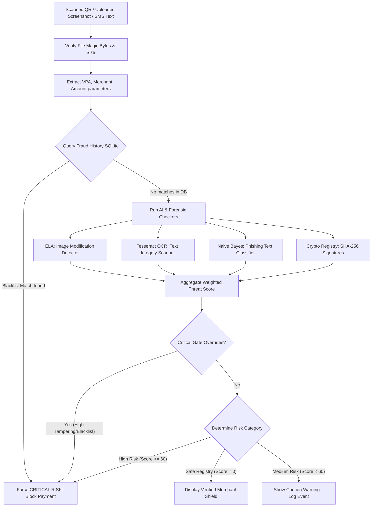
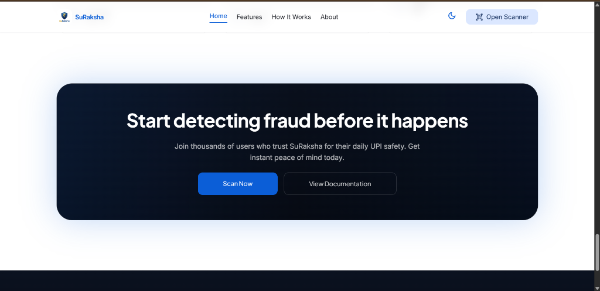
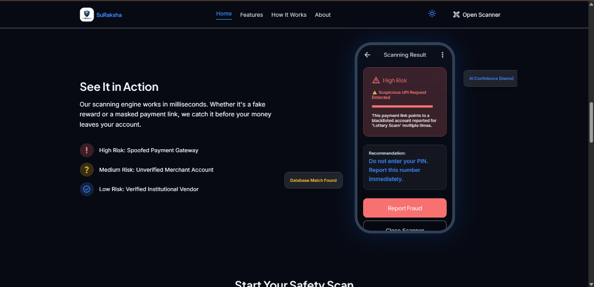
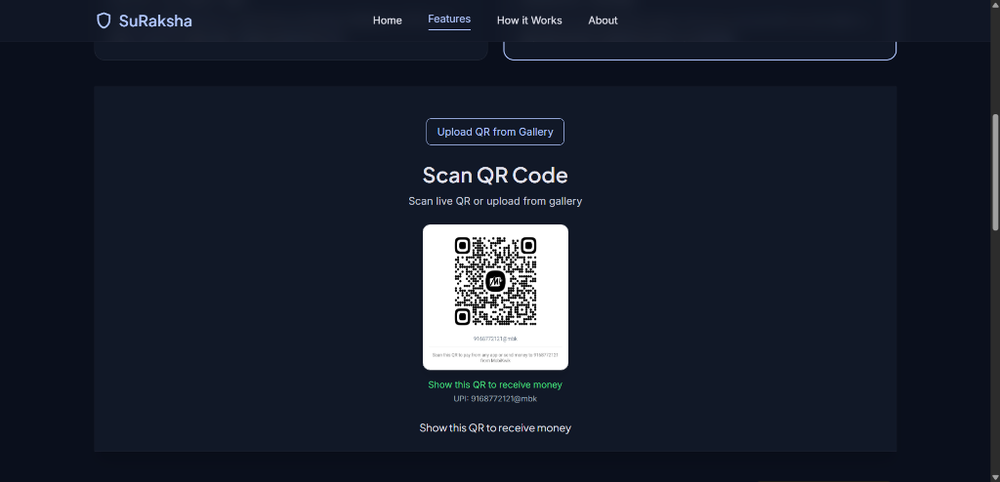
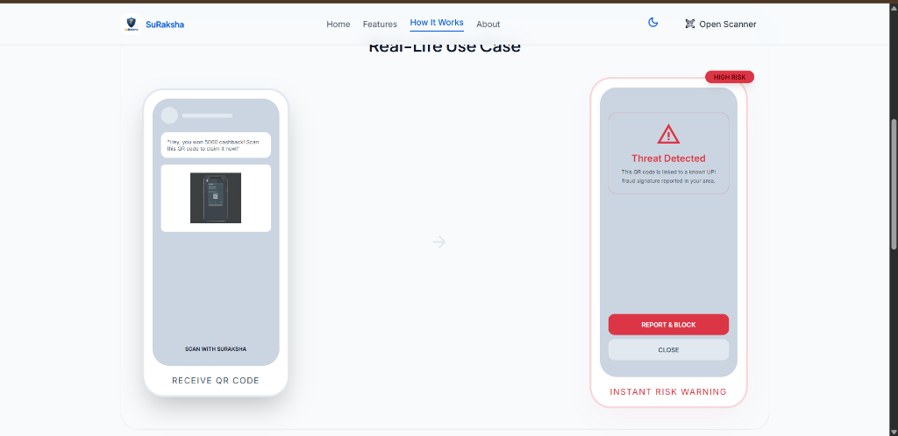
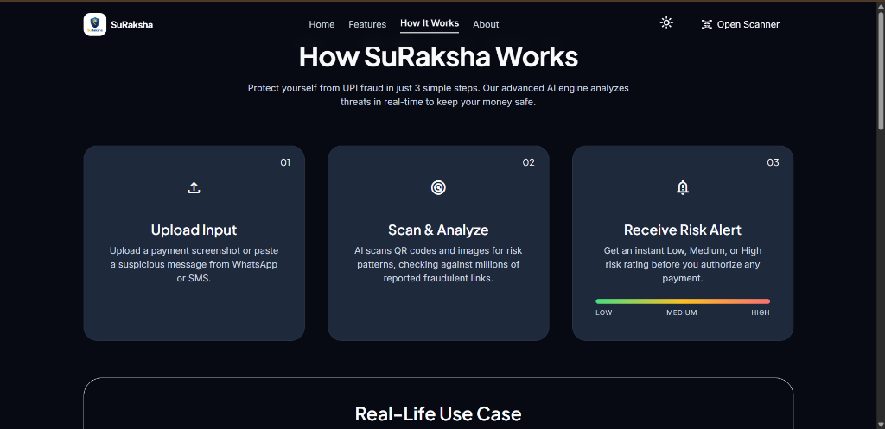

<p align="center">
  
</p>

<h1 align="center">🛡️ SuRaksha – AI-Powered UPI Fraud Detection System</h1>

<p align="center">
  
  
  
  
  
  
</p>

<p align="center">
  <strong>SuRaksha</strong> is a premium, zero-trust cybersecurity shield designed specifically for the Indian UPI (Unified Payments Interface) transaction ecosystem. It integrates real-time image forensics, natural language processing, client-side cryptography, and geolocated threat intelligence to intercept and block digital payment fraud before a user inputs their secure UPI PIN.
</p>

---

## 🔍 Problem Statement

With the exponential rise of UPI payments in India, fraudsters have developed highly sophisticated scams targeting daily payers, merchants, and vulnerable citizens:
1. **Physical QR Sticker-Swapping**: Replacing static merchant QR stickers on shop boards with malicious recipient handles.
2. **Doctored Payment Receipts**: Modifying transaction amounts, timestamps, and VPA addresses on success screens to walk away with goods without paying.
3. **Linguistic Phishing Scams**: SMS and WhatsApp templates mimicking electric departments, KYC blocks, or cashback rewards to trigger scam pay requests.
4. **Brand Mimicry / Typosquatting**: Spoofing VPAs (e.g. `electricity.bill@ybl` instead of `electricity.bill@sbi`) to divert funds.

---

## 💡 Solution Architecture

SuRaksha acts as a zero-trust gateway. Scanned QR codes, uploaded receipts, or suspicious texts pass through a sequential verification pipeline:



---

## 📸 Interface Showcase

### 🖥️ Command Center Dashboard
The premium landing dashboard features real-time threat telemetry ticker stats, glassmorphic HUD status modules, and animated navigation.


### 🔍 Real-Time Threat Analysis & Reporting
Whenever an analysis resolves, the engine generates an instant risk rating (Low, Medium, or High Risk) complete with contextual security reasons and warnings.


### 📷 Secure QR Scanner & Signer
An interactive scanner showing a live camera feed with glowing corner brackets and laser sweeps. Features a merchant section that generates signed payment codes.


### 🧪 Attack Vector Simulator Sandbox
A specialized testing canvas allowing developers and security auditors to paste suspicious templates or upload receipt images to verify OCR and ELA results.


### 📈 Step-by-Step Onboarding Workflow
Simple walkthrough tutorial details how SuRaksha intercepts fraud, checking VPAs, and preventing unverified checkout redirects.


---

## 🎨 Advanced Engineering Deep-Dive

### 1. Client-Side Cryptographic QR Signing
To defend against QR board sticker swapping, SuRaksha implements a client-side signature registry. Verified merchants generate signed QR codes using the client-side Web Crypto API. The merchant signature is computed as:
$$\text{Signature} = \text{SHA256}(\text{Name.toLowerCase()} + \text{VPA.toLowerCase()} + \text{SecretKey})$$
During a scan, the QR analyzer extracts the merchant parameters and matches the signature against the local registry:
* **No Signature**: Automatically flagged as `Sticker Tampering Detected` (**Risk: 95%**).
* **Signature Mismatch**: Flagged as `Spoofed QR Board Hack` (**Risk: 98%**).
* **Signature Match**: Renders a glowing green `Verified Merchant Shield` (**Risk: 0%**).

### 2. Zero-Disk In-Memory Image Forensics (ELA)
Doctored screenshots of successful transactions are processed **entirely in-memory with zero disk footprint** to defend against file inclusion, directory traversal, and server storage pollution:
- **EXIF Stripping & Re-encoding**: The Flask server reads the file stream into RAM (`io.BytesIO`), reconstructs the canvas using `PIL.Image` (which strips all EXIF headers and metadata), and saves it as clean JPEG bytes.
- **Pixel Density & Laplacian Variance**: Measures the sharpness variance of the image. Sharpness variance $>2000$ points to composite overlays or upscaled text.
- **Error Level Analysis (ELA)**: Re-saves the sanitized image at 75% JPEG quality and computes the absolute difference from the original:
  $$\text{ELA} = |\text{Image}_{\text{original}} - \text{Image}_{\text{resaved-75\%}}|$$
  A natural image has uniform error distribution. Spliced text or overlaid payment values show high maximum-to-mean local error ratios ($>25$), indicating local tampering.

### 3. Critical Gate Overrides
To ensure that visual text verification anomalies cannot be "washed out" or hidden by clean text keywords or safe domain names, the risk aggregator implements **Override Gates**:
- **Tampering Override**: If ELA tampering risk $\ge 75\%$ (score $\ge 7.5/10$), the aggregator bypasses linear weights and forces the risk score to `99% (CRITICAL)`.
- **Metadata Software Override**: If EXIF metadata indicates the use of disallowed image editing suites (score $\ge 4.5/10$), the aggregator forces the risk score to `95% (CRITICAL)`.

### 4. Rate-Limiting & Data Poisoning Defense
To prevent automated DDoS spam and **Machine Learning Data Poisoning** (where attackers submit fraudulent reports to skew NLP classifier weights), SuRaksha integrates IP-based rate limiting via `Flask-Limiter`:
- **JSON Error Handler**: Intercepts rate rejections globally and formats the response as standard JSON (HTTP `429 Too Many Requests`) containing details on active rate thresholds.
- **Frontend Toast Integration**: The client API handler extracts the rate cooldown details from the JSON payload and displays it inside a temporary warning toast.

---

## 📡 REST API Reference

| Endpoint | Method | Payload | Rate Limit | Description |
| :--- | :--- | :--- | :--- | :--- |
| `/analyze/image`<br>*(Alias: `/analyze`)* | `POST` | `multipart/form-data`<br>• `image`: File (max 5MB)<br>• `intent`: String | `40 per minute` | Uploads payment receipts or screenshot notifications to execute EXIF, ELA, and OCR validation **entirely in-memory**. |
| `/analyze/text`<br>*(Alias: `/analyze/message` or `/analyze_text`)* | `POST` | `application/json`<br>• `text`: String (max 5000 chars)<br>• `intent`: String | `60 per minute` | Validates WhatsApp, SMS, or copied billing messages using the Naive Bayes NLP classifier. |
| `/analyze/qr` | `POST` | `application/json`<br>• `text`: String | `40 per minute` | Parses scanned UPI QR codes, checks VPA blacklists, and validates cryptographic signatures. |
| `/api/report` | `POST` | `application/json`<br>• `upi`: String<br>• `description`: String | `15 per minute` | Saves a community scam report to SQLite and retrains text classification vectors. |
| `/api/stats` | `GET` | *None* | *Default* | Returns platform stats (Total Scans, Threats Blocked, Unique Frauds, Total Reports). |
| `/api/soc/threats` | `GET` | *None* | *Default* | Returns geolocated threat feeds mapping active incidents to regional coordinate hotspots. |
| `/api/blacklist/sync` | `GET` | *None* | *Default* | Exports all flagged threat VPAs and risk scores for local/offline caching. |

---

## 🏗️ Project Folder Structure

```text
SuRaksha/
├── backend/
│   ├── routes/
│   │   ├── analyze.py         # In-memory image verification, ELA & OCR routes
│   │   ├── health.py          # API status checks
│   │   ├── qr.py              # QR parsing, limiter & blacklist sync routes
│   │   └── report.py          # Complaints, stats & threat map feeds
│   ├── services/
│   │   ├── history_store.py   # SQLite connection manager & migrations
│   │   ├── ml_classifier.py   # TF-IDF + Naive Bayes training loop
│   │   ├── ocr_service.py     # Tesseract OCR parser
│   │   ├── tamper_detector.py # OpenCV Edge, Laplacian & ELA checkers
│   │   ├── qr_risk_analyzer.py# VPA verification and domain checks
│   │   └── master_engine.py   # Pipeline aggregator and scoring
│   ├── utils/
│   │   ├── limiter.py         # Shared Flask-Limiter configuration
│   │   └── constants.py       # Global constants & VPA registries
│   ├── fraud_history.db       # SQLite3 relational database
│   ├── requirements.txt       # Python dependencies (includes Flask-Limiter)
│   └── app.py                 # Flask server & JSON HTTP 429 error handlers
│
├── frontend/
│   ├── index.html             # Command Center Dashboard
│   ├── scan.html              # Camera QR Scanner, Cryptographic QR Generator & SOC Map
│   ├── test.html              # Interactive Attack Vector Sandbox
│   ├── features.html          # Bento-Grid Feature Matrix
│   ├── how.html               # Step-by-step User Tutorials
│   ├── about.html             # Team showcase & quick simulator
│   ├── result.html            # Detailed Threat Analysis HUD
│   ├── css/
│   │   └── index.css          # Core Styling Sheet
│   └── js/
│       ├── app.js             # API router, toast handler & dynamic translation
│       ├── language.js        # Bilingual MutationObserver engine
│       └── theme.js           # Glassmorphic Theme manager (Light / Dark)
│
├── verify_security.py         # Automated API, headers, and rate-limiting test suite
└── README.md                  # System Documentation
```

---

## 🚀 Getting Started & Local Setup

### 1. Prerequisites
- **Python 3.8+**
- **Tesseract OCR Binary**
  - **Windows**: Download installer from [UB-Mannheim](https://github.com/UB-Mannheim/tesseract/wiki) and add `C:\Program Files\Tesseract-OCR` to your System `PATH` variable.
  - **Linux (Ubuntu/Debian)**: `sudo apt-get install tesseract-ocr libtesseract-dev`
  - **macOS (Homebrew)**: `brew install tesseract`

### 2. Backend Installation & Server Launch
```bash
# 1. Navigate to backend directory
cd backend

# 2. Configure virtual environment
python -m venv venv
# Activate on Windows (PowerShell):
venv\Scripts\Activate.ps1
# Activate on Linux/macOS:
source venv/bin/activate

# 3. Install Python requirements
pip install -r requirements.txt

# 4. Start Flask Server
python app.py
```
*The Flask backend compiles `init_db()` dynamic index structures and runs on `http://127.0.0.1:5000`.*

### 3. Frontend Web Server Launch
```bash
# Navigate to project root folder and start http.server
cd ..
python -m http.server 8000
```
*Open [http://localhost:8000/frontend/index.html](http://localhost:8000/frontend/index.html) in your browser.*

---

## 📊 Automated Verification Tests
You can verify the backend pipelines, security headers, rate limiters, and in-memory upload configurations by executing the automated test suite:
```bash
python verify_security.py
```

---

## 👨‍💻 Engineering & Development Team

* **Suraj Sawant** — Team Lead & Lead AI Architect
* **Antigravity** — AI Pair Programmer
* **Stitch** — AI Collaboration Specialist

---

## ⚠ Disclaimer
This system was built for educational and hackathon purposes. The visual mockups and threat analytics demonstrate proof-of-concept cybersecurity heuristics. It should not be used as-is for commercial banking operations or financial auditing.
